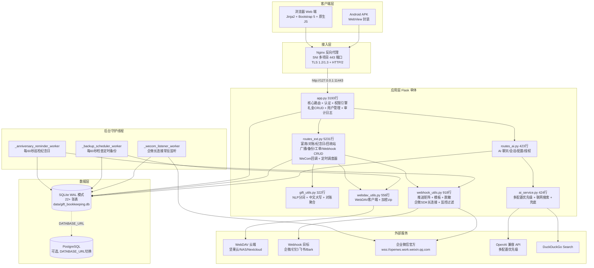
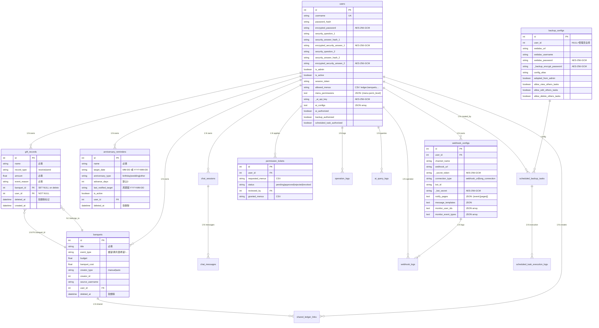
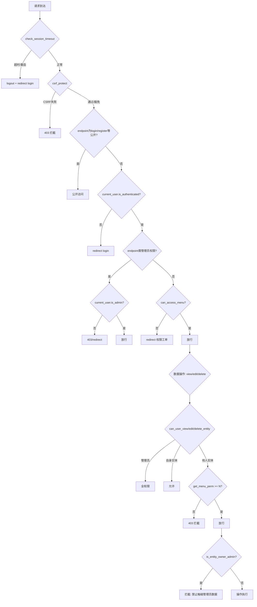
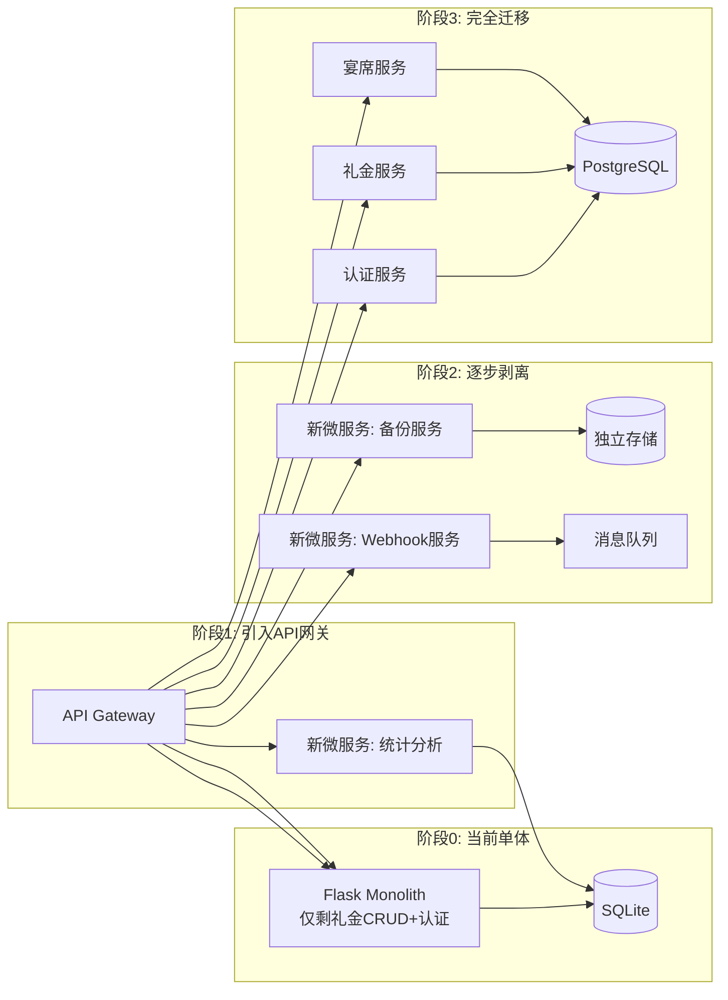

---
AIGC:
  ContentProducer: '001191110102MAD55U9H0F10002'
  ContentPropagator: '001191110102MAD55U9H0F10002'
  Label: '1'
  ProduceID: 'e9db0125-8987-4eeb-b6ba-26a650cf582a'
  PropagateID: 'e9db0125-8987-4eeb-b6ba-26a650cf582a'
  ReservedCode1: 'c0aea627-6252-43a5-9e53-62dd1bd9383a'
  ReservedCode2: 'c0aea627-6252-43a5-9e53-62dd1bd9383a'
---

# 人情礼金记账系统 PSD 设计与重构决策文档

> **版本**：V1.0  
> **生成日期**：2026-09-23  
> **项目根目录**：`C:\Users\cheng\Documents\akshare-test\gift_bookkeeping_app`  
> **审计基线**：代码 commit `f1e6744`（main 分支，filter-repo 重写后；原 6360bb6），README.md V10.10.10，Project_Survey.md ADR-01~38  
> **文档定位**：以代码为实现真相（Ground Truth），历史文档为设计意图真相，显式揭露漂移，证据链闭环。

---

## 目录

- [阶段 0：资产自发现与执行计划](#阶段-0资产自发现与执行计划)
- [第 1 部分：项目全局概览](#第-1-部分项目全局概览)
- [第 2 部分：文档-代码差异与漂移矩阵 (Drift Matrix)](#第-2-部分文档-代码差异与漂移矩阵-drift-matrix)
- [第 3 部分：架构模式识别](#第-3-部分架构模式识别)
- [第 4 部分：架构耦合度诊断](#第-4-部分架构耦合度诊断)
- [第 5 部分：架构替换与轻量化可行性决策](#第-5-部分架构替换与轻量化可行性决策)
- [第 6 部分：前后端详尽规格（校准整合版）](#第-6-部分前后端详尽规格校准整合版)
- [第 7 部分：数据持久化设计](#第-7-部分数据持久化设计)
- [第 8 部分：工程与安全保障](#第-8-部分工程与安全保障)
- [第 9 部分：综合问题排查与渐进演进路线图](#第-9-部分综合问题排查与渐进演进路线图)

---

## 阶段 0：资产自发现与执行计划

### 0.1 历史设计资产探测

递归检索项目内所有 `.md` 文档及含有架构/设计/规范关键字的文件，共发现 **4 份历史文档**：

| # | 文件路径 | 行数 | 预估用途 | 时效性判定 |
|---|---------|------|---------|-----------|
| 1 | `README.md` | 1042 | **用户手册 + 版本变更日志**（V2~V10.10.10，含功能说明、部署指南、样例数据、多仓库矩阵） | **新** — 最后更新 2026-09-22，版本迭代到 V10.10.10，与代码高度同步 |
| 2 | `Project_Survey.md` | 948+ | **系统架构设计规范 + ADR 决策记录**（ADR-01~ADR-38，含 6 大故障根因审计、业务模块设计规范、权限模型、Webhook/WebDAV/纪念日架构决策） | **新** — 最后更新 2026-09-22，ADR 追加到 38 条，是核心设计意图资产 |
| 3 | `AI_ASSISTANT_DESIGN.md` | 1932+ | **AI 助手模块技术设计 + 综合修复记录**（ER 图、API 规范、前端设计、V2~V10.7 逐版本修复详情） | **较新** — 最后更新约 V10.7（2026-09-17），后续 V10.8~V10.10.10 的修复记录仅在 README.md 中，未同步至此文档 |
| 4 | `V8_修复设计方案.md` | 240 | **V8 修复设计方案**（12 项需求的独立方案文档，已确认定稿） | **草稿/已归档** — 内容已被 AI_ASSISTANT_DESIGN.md 第十二章完整吸收，无独立参考价值 |

### 0.2 代码骨架与技术栈初判

#### 代码体量分布（行数为编辑器总行数口径，2026-09-23 实测）

| 文件 | 行数 | 占比 | 职责 |
|------|------|------|------|
| `routes_ext.py` | 5,231 | 40.3% | 业务扩展路由（最大单体文件） |
| `app.py` | 3,193 | 24.6% | Flask 核心 + 礼金 CRUD + 用户管理 |
| 21 个 HTML 模板 | 11,785 | — | 前端视图层（最大 1,527 行） |
| `models.py` | 1,071 | 8.2% | 22+ 张数据表模型定义 |
| `webhook_utils.py` | 918 | 7.1% | Webhook 推送引擎 |
| `webdav_utils.py` | 556 | 4.3% | WebDAV 客户端 |
| `run.sh` | 551 | 4.2% | 部署脚本 |
| `ai_service.py` | 424 | 3.3% | AI 核心服务 |
| `routes_ai.py` | 423 | 3.3% | AI 路由 |
| `gift_utils.py` | 322 | 2.5% | NLP 与对账工具 |
| 其他 | 302 | 2.3% | SSL 生成（152）、Web 搜索（81）、Nginx 配置（69） |
| **核心代码合计** | **12,991** | — | 不含模板；含模板共 24,776 行 |

#### 模板文件行数

| 文件 | 行数 |
|------|------|
| `admin_webhooks.html` | 1527 |
| `admin_users.html` | 1359 |
| `admin_backups.html` | 1249 |
| `index.html` | 1079 |
| `banquet_detail.html` | 994 |
| `reminders.html` | 862 |
| `banquets.html` | 648 |
| `ai_assistant.html` | 484 |
| `permission_tickets.html` | 461 |
| `admin_ai_config.html` | 449 |
| `base.html` | 398 |
| `recycle_bin.html` | 370 |
| `reconciliation.html` | 368 |
| `admin_logs.html` | 265 |
| `profile_security.html` | 262 |
| `admin_broadcasts.html` | 231 |
| `login.html` | 199 |
| `forgot_password.html` | 193 |
| `register.html` | 171 |
| `shared_ledger.html` | 164 |
| `change_password.html` | 52 |
| **合计** | **11,785** |

### 0.3 文档采纳决策

| 文档 | 采纳角色 | 理由 |
|------|---------|------|
| `Project_Survey.md` | **架构意图主源** | 38 条 ADR 是架构决策的权威记录，业务模块设计规范详尽 |
| `README.md` | **功能现状与版本演进主源** | 版本变更日志完整到 V10.10.10，功能清单与部署指南准确 |
| `AI_ASSISTANT_DESIGN.md` | **AI 模块与 V2~V10.7 修复细节参考** | ER 图、API 规范、前端设计详实，但需标注 V10.8+ 记录缺失 |
| `V8_修复设计方案.md` | **排除**（已被 AI_ASSISTANT_DESIGN.md 第十二章完整吸收） | 独立草稿，无增量信息 |

> **归档说明**（2026-09-23）：上表所列 Project_Survey.md、AI_ASSISTANT_DESIGN.md、V8_修复设计方案.md 三份历史文档，已在本 PSD 定稿后移入回收站归档。全文对其引用均记录审计时点状态，不影响本 PSD 的代码事实结论。

---

## 第 1 部分：项目全局概览

### 1.1 业务定位

人情礼金记账系统（Gift Bookkeeping App）是一套面向中国家庭/小团队的人情往来资产管理工具，核心解决三大痛点：
1. **礼金收支记账**：收礼/送礼双向记录，自然语言复合拆分一键入库
2. **人情对账追踪**：按亲友聚合收送差额，自动判定"待补礼/待还礼/已平账"
3. **多渠道预警推送**：企业微信/钉钉/飞书 Webhook + 企微官方长连接机器人，纪念日到期主动推送

系统具备多用户细粒度权限、WebDAV 加密云备份、AI 助手、权限工单审批等企业级能力，部署形态覆盖 Web 原生、Docker Compose 和 Android APK 三种交付。

### 1.2 真实技术栈全景清单

| 层级 | 技术选型 | 版本 | 代码依据 |
|------|---------|------|---------|
| **后端语言** | Python | 3.12（本地）/ 3.11-slim（Docker） | `run.sh:367` |
| **Web 框架** | Flask | 3.0.3 | `requirements.txt:1`、`app.py:42` |
| **ORM** | Flask-SQLAlchemy | 3.1.1 | `requirements.txt:2`、`models.py:75` |
| **认证** | Flask-Login (Session) | 0.6.3 | `requirements.txt:4`、`app.py:90-93` |
| **CSRF** | Flask-WTF | 1.2.1 | `requirements.txt:3`、`app.py:214-238` |
| **密码哈希** | Werkzeug | 3.0.3 | `requirements.txt:5`、`models.py:9` |
| **对称加密** | cryptography (AES-256-GCM) | 42.0.8 | `requirements.txt:7`、`models.py:10,27-43` |
| **数据库** | SQLite (WAL) / PostgreSQL (可选) | — | `app.py:68-78`，`DATABASE_URL` 环境变量切换 |
| **PostgreSQL 驱动** | psycopg2-binary | 2.9.9 | `requirements.txt:8`（切换 PostgreSQL 的必要依赖） |
| **WSGI 容器** | Gunicorn (已声明但**未实际使用**) | 22.0.0 | `requirements.txt:6`；`run.sh:362-368` 实际用 `python3 app.py` |
| **反向代理** | Nginx (SNI 多项目 443) | — | `nginx_ssl.conf`、`run.sh:224-291` |
| **前端** | Jinja2 + Bootstrap 5 + 原生 JS | — | `templates/base.html:13-14`（**CDN 加载**） |
| **图表** | Chart.js | — | 模板内 CDN 引入 |
| **PWA** | Service Worker | — | `static/sw.js`（1053 bytes） |
| **AI 接入** | OpenAI Python SDK | >=1.0.0 | `requirements.txt:14`、`ai_service.py` |
| **联网搜索** | DuckDuckGo Search | >=4.0.0 | `requirements.txt:15`、`web_search.py` |
| **企微机器人** | wecom-aibot-python-sdk | >=1.0.2 | `requirements.txt:11`、`aibot/` 目录 |
| **企微 SDK 运行依赖** | websockets + pyee | >=12.0 / >=11.0 | `requirements.txt:12-13`（长连接与事件循环） |
| **Webhook 网络** | requests + aiohttp | >=2.31.0 / >=3.9.0 | `requirements.txt:9-10`、`webhook_utils.py:18,47` |
| **加密备份** | pyzipper | >=0.3.1 | `requirements.txt:16`、`webdav_utils.py` |
| **部署脚本** | POSIX Shell (`#!/bin/sh`) | — | `run.sh:1`（551 行，兼容 dash/sh） |
| **SSL 证书** | 自签（cryptography 库生成） | — | `generate_ssl_certs.py` |

### 1.3 端到端架构拓扑图



---

## 第 2 部分：文档-代码差异与漂移矩阵 (Drift Matrix)

> 以下矩阵基于 `Project_Survey.md`（38 条 ADR）、`AI_ASSISTANT_DESIGN.md`、`README.md` 与实际代码的逐条交叉核验。

### 2.1 关键漂移项

| # | 模块/功能 | 历史文档记载 | 代码真实实现 | 状态 | 影响评估 |
|---|---------|------------|------------|------|---------|
| D-01 | **akshare 金融数据集成** | `Project_Survey.md` §3 详述 akshare 集成方案、熔断/降级/超时守卫规范；§1.1 定位含"金融量化/市场数据中台能力" | `requirements.txt` 无 akshare 依赖；全项目无 `import akshare`；`web_search.py` 仅用 DuckDuckGo | **未落地** | **低** — 业务上从未使用，文档描述与系统实际定位脱节，建议从文档中标注为"规划中/搁置" |
| D-02 | **Gunicorn 多 Worker 生产部署** | `Project_Survey.md` ADR-01 决策"全面采用 Gunicorn -w 4 -k gthread --threads 4"；`requirements.txt:6` 声明 gunicorn==22.0.0 | `run.sh:362-368` 实际启动命令为 `python3 $APP_SCRIPT`（Werkzeug 开发服务器），无 Gunicorn 调用 | **已废弃** | **高** — 开发服务器在生产环境存在并发瓶颈（Project_Survey.md §2 BUG-02 已诊断此问题），ADR-01 的解决方案未落地 |
| D-03 | **CDN 依赖彻底移除** | `Project_Survey.md` ADR-03 决策"彻底移除国外外部公共 CDN 链接，静态资源本地化" | `templates/base.html:13-14` 仍从 `cdn.jsdelivr.net` 加载 Bootstrap 5、从 `cdnjs.cloudflare.com` 加载 Font Awesome | **未落地** | **高** — ADR-03 专门为解决内网/弱网白屏问题（BUG-04）而决策，但实际代码未执行该决策 |
| D-04 | **Celery/Redis 任务队列** | `Project_Survey.md` ADR-04 决策"企业级方案引入 Redis + Celery 任务队列" | 代码使用 Python `threading.Thread` daemon 线程（`_anniversary_reminder_worker`、`_backup_scheduler_worker`、`_wecom_listener_worker`），无 Celery/Redis 依赖 | **方案降级** | **低** — 对当前单机部署规模合理，但文档应标注实际选型为轻量线程池方案 |
| D-05 | **权限级别 1 语义** | `Project_Survey.md` ADR-25 决策"级别 1 为全局绝对全只读模式，严禁修改或删除任何数据（包括自身创建的实体）" | V10.4 已修正为"自身全权 + 仅查看他人数据"（`app.py` `can_user_edit_entity` 自身实体可编辑，他人实体需 perm>=2）；`README.md` V10.4 记录了此变更但 ADR-25 未更新 | **已重构** | **中** — ADR-25 文档与代码语义矛盾，需更新 ADR 或新增 ADR 记录此次修正 |
| D-06 | **AI_ASSISTANT_DESIGN.md 版本覆盖** | 文档覆盖到 V10.7（2026-09-17），含 ER 图/API 规范/前端设计/逐版本修复 | V10.8~V10.10.10（约 20+ 条修复）仅在 `README.md` 变更日志中，未同步至本文档 | **版本断层** | **低** — 文档参考价值降低但不影响运行；新 PSD 应以 README.md 为最新事实源 |
| D-07 | **Service Worker 超时熔断** | `Project_Survey.md` BUG-06 决策"为 Service Worker fetch 增加超时限制与离线降级分支" | `static/sw.js` 仅 1053 bytes，无 `fetch` 事件拦截逻辑，无超时/降级代码 | **未落地** | **低** — 当前 SW 仅做 manifest 缓存壳，实际未拦截请求，反而避免了 BUG-06 描述的问题 |
| D-08 | **数据库连接超时** | `Project_Survey.md` ADR-02 决策 `connect_args={'timeout': 30}` | `app.py:83-84` 确实设置 `'timeout': 30`；`app.py:878-879` 设置 `PRAGMA busy_timeout=30000` | **一致** | — |
| D-09 | **AES-256-GCM 加密存储** | `Project_Survey.md` ADR-05/ADR-36 决策"敏感凭据 AES-256-GCM 加密落盘" | `models.py:27-43` `encrypt_credential`/`decrypt_credential` 实现 AESGCM；`WebhookConfig._secret_token`/`_bot_secret`、`BackupConfig._backup_encrypt_password`、`User._ai_api_key`、`SharedLedgerLink._access_password` 均密文存储 | **一致** | — |
| D-10 | **CSRF 全局保护** | `Project_Survey.md` ADR-05 决策"CSRF 强校验" | `app.py:214-238` 手动实现 CSRF token 生成与校验（非依赖 Flask-WTF 内置 decorator），企微回调/根路径/Webhook 接口免除 | **一致** | — |

### 2.2 漂移影响汇总

| 严重度 | 数量 | 漂移项 |
|--------|------|--------|
| **高影响** | 2 | D-02（Gunicorn 未落地）、D-03（CDN 未移除） |
| **中影响** | 1 | D-05（权限级别 1 语义矛盾） |
| **低影响** | 4 | D-01（akshare 未落地）、D-04（Celery 降级）、D-06（文档断层）、D-07（SW 未落地） |
| **一致** | 3 | D-08、D-09、D-10 |

---

## 第 3 部分：架构模式识别

### 3.1 模式判定：经典单体应用（Monolith）

**判定依据**：

| 维度 | 观察结论 | 代码依据 |
|------|---------|---------|
| **部署单元** | 单一 Python 进程，无微服务拆分 | `run.sh:362` `python3 $APP_SCRIPT` |
| **路由装配** | Flask 单 app 实例 + `register_routes_ext()` 注册扩展路由 + `routes_ai` 模块注册 AI 路由 | `app.py:33` `from routes_ext import register_routes_ext`；`routes_ext.py` 在函数内用 `@app.route` 注册 |
| **数据访问** | 全量 ORM（SQLAlchemy），无 Repository/DAO 抽象层；Model 直接在路由中 `query` | `app.py:960` `get_accessible_records_query(current_user)` 直接操作 Model |
| **通信模式** | 进程内同步调用，无 RPC/消息队列；异步任务用 daemon 线程 | `routes_ext.py:7` `import threading`；无 Celery/RabbitMQ/Kafka |
| **状态管理** | 服务端 Session（Flask-Login），无 JWT/Token 无状态设计 | `app.py:90-93` `LoginManager` |
| **前端渲染** | 服务端渲染（Jinja2 SSR），无 SPA/CSR 分离 | `templates/*.html` 21 个模板 |

### 3.2 分层结构（实际 vs 理想）

```
理想分层:                          实际分层:
┌─────────────────┐               ┌─────────────────────┐
│  Controller     │               │  Route Handler      │  ← 胖 Controller
│  (薄路由)        │               │  (路由+业务+数据访问  │     (app.py 3193行
├─────────────────┤               │   +权限校验+日志     │      routes_ext.py 5231行)
│  Service        │               │   +Webhook推送       │
│  (业务逻辑)     │  ← 缺失       ├─────────────────────┤
├─────────────────┤               │  Model              │
│  Repository     │  ← 缺失       │  (SQLAlchemy ORM     │
├─────────────────┤               │   +加解密property    │
│  Model          │               │   +权限方法)          │
└─────────────────┘               └─────────────────────┘
```

**关键发现**：系统**无 Service 层和 Repository 层**，业务逻辑直接内嵌在路由函数中。权限校验、Webhook 推送、审计日志、数据查询全部在同一个函数内完成，形成典型的**胖 Controller 反模式**。

### 3.3 模块间通信模式

| 通信类型 | 实现方式 | 代码依据 |
|---------|---------|---------|
| **同步 HTTP** | Flask 路由处理 → Jinja2 渲染 → 返回 HTML | 全部 `@app.route` |
| **AJAX 异步** | 前端 `fetch()` → 后端 `jsonify()` | `templates/base.html:233-259` 全局 Fetch 拦截器 |
| **后台线程** | `threading.Thread(daemon=True)` 三常驻线程 | `routes_ext.py` 三个 worker 函数 |
| **外部 HTTP** | `requests.Session()` 连接池 | `webhook_utils.py:47`、`webdav_utils.py` |
| **WebSocket 长连接** | `aibot.WSClient` 企微官方 SDK | `webhook_utils.py:29` `from aibot import WSClient` |
| **数据库直连** | SQLite 文件级 / PostgreSQL TCP | `app.py:80` `SQLALCHEMY_DATABASE_URI` |

---

## 第 4 部分：架构耦合度诊断

### 4.1 纯业务代码（框架无关，可直接复用）

| 模块 | 文件 | 行数 | 复用评估 |
|------|------|------|---------|
| NLP 分词引擎 | `gift_utils.py:58-86` `split_gift_nlp_text` | ~30 | 纯 Python 正则，零框架依赖，**可直接复用** |
| 中文大写数字转换 | `gift_utils.py:13-55` `cn2num` | ~43 | 纯算法，零依赖，**可直接复用** |
| 对账聚合计算 | `gift_utils.py` `calculate_reconciliation` | ~50 | 纯数据计算逻辑，**可直接复用** |
| AES-256-GCM 加解密 | `models.py:14-73` `encrypt_credential`/`decrypt_credential` | ~60 | 仅依赖 `cryptography` 库，**可直接复用** |
| CSV 导出逻辑 | `app.py:2961-2998` `export_csv` 核心 | ~40 | CSV 格式化逻辑可复用，路由绑定需剥离 |
| Cron 表达式解析 | `routes_ext.py` `_cron_match` | ~40 | 纯算法，**可直接复用** |

**纯业务代码占比估计：约 15-20%**（~2,200 行）

### 4.2 强侵入代码（强依赖框架 API，替换必须重写）

| 模块 | 文件 | 行数 | 耦合点 |
|------|------|------|--------|
| **全部路由处理** | `app.py` + `routes_ext.py` + `routes_ai.py` | ~7,942 | `@app.route`、`request`/`flash`/`redirect`/`url_for`/`jsonify`、`render_template` |
| **认证中间件** | `app.py:155-261` | ~107 | `@app.before_request`、`current_user`、`login_user`/`logout_user`、`session` |
| **CSRF 保护** | `app.py:214-238` | ~25 | Flask `request.form`/`session`/`abort` |
| **模板渲染** | 21 个 HTML 模板 | 11,785 | Jinja2 模板语法 ``、`{{ }}`、`url_for()` |
| **ORM 模型** | `models.py` 全量 | 1,071 | `db.Model`、`db.Column`、`db.relationship`、`db.session` |
| **Webhook 推送引擎** | `webhook_utils.py` | 918 | `trigger_webhook_event` 直接操作 `WebhookConfig.query` |
| **权限引擎** | `app.py` `can_user_*` 系列 + `models.py` `get_menu_perm` | ~200 | 与 Flask `current_user`、SQLAlchemy `query` 深度耦合 |

**强侵入代码占比估计：约 80-85%**

### 4.3 分层退化坏味道

#### 坏味道 1：胖 Controller — 路由函数承载全部逻辑

**典型代码**：`routes_ext.py` `admin_upload_local_backup` 路由（~130 行）

```
路由函数内完成：
  ① 文件上传校验 → ② 文件命名/归属校验 → ③ 数据库完整性检查 →
  ④ 权限判定（管理员/普通用户分流）→ ⑤ 文件级替换 或 数据级合并 →
  ⑥ ATTACH DATABASE 跨库操作 → ⑦ init_database 迁移 →
  ⑧ Webhook 推送 → ⑨ 审计日志 → ⑩ Flash 提示 + 重定向
```

**影响**：单个函数职责超过 10 个，任何修改都有高回归风险。

#### 坏味道 2：SQL 外露 — ORM 之外直接执行原生 SQL

**典型代码**：`routes_ext.py:47-105` `build_user_scoped_backup_db`

```python
# 直接 sqlite3.connect 而非 SQLAlchemy
_src_conn = _sqlite3.connect(db_path)
_dst_conn = _sqlite3.connect(tmp_db)
with _dst_conn:
    _src_conn.backup(_dst_conn)
# 直接执行 DELETE/DROP TABLE
c.execute("DELETE FROM gift_records WHERE user_id != ?", (user.id,))
c.execute(f'DROP TABLE IF EXISTS "{tbl}"')
```

**影响**：绕过 ORM 的事务管理和连接池，存在数据库状态不一致风险。

#### 坏味道 3：数据库迁移硬编码 SQL — 无版本管理

**典型代码**：`app.py:681-817` `init_database` migration_sqls

```python
migration_sqls.extend([
    "ALTER TABLE backup_configs ADD COLUMN config_alias VARCHAR(100)",
    "ALTER TABLE backup_configs ADD COLUMN adopted_from_admin BOOLEAN DEFAULT 0",
    ...
])
# 逐条 try-except 忽略错误
for sql in migration_sqls:
    try:
        conn.execute(db.text(sql))
        conn.commit()
    except Exception:
        pass  # 已存在则跳过
```

**影响**：无 Alembic/Flask-Migrate 版本管理，迁移失败被静默吞没，无法回滚。

#### 坏味道 4：路由文件膨胀失控

| 文件 | 行数 | 路由数量（估计） | 单文件职责 |
|------|------|---------------|---------|
| `routes_ext.py` | 5,231 | ~82 个路由 | 宴席/对账/纪念日/回收站/广播/备份/工单/Webhook/WeCom/定时任务 |
| `app.py` | 3,193 | ~37 个路由 | 礼金CRUD/认证/用户管理/审计日志/安全配置/导出导入 |

**影响**：单文件 5231 行已超出可维护阈值，模块边界模糊。

#### 坏味道 5：前端逻辑内联 — JS 与 HTML 混杂

`admin_webhooks.html`（1527 行）中包含大量内联 `<script>`，矩阵配置/事件绑定/AJAX 逻辑全部嵌在 HTML 中，无独立 JS 模块。

---

## 第 5 部分：架构替换与轻量化可行性决策

### 5.1 评估动机

| 评估维度 | 当前状态 | 是否存在瓶颈 |
|---------|---------|------------|
| **框架重量** | Flask 3.0 轻量级，无过度抽象 | **否** — Flask 本身足够轻量，非瓶颈 |
| **并发性能** | Werkzeug 开发服务器单线程 | **是** — 生产部署仍用 `python3 app.py`，无多 Worker（D-02 漂移） |
| **代码可维护性** | 5231 行单文件，无 Service 层 | **是** — 胖 Controller 已导致修改回归风险高 |
| **前端体验** | Jinja2 SSR + CDN 依赖 + 内联 JS | **部分** — CDN 在内网不可用（D-03 漂移），但 SSR 本身满足业务需求 |
| **数据库扩展** | SQLite WAL 足够单机场景 | **否** — 已支持 PostgreSQL 无缝切换 |
| **部署复杂度** | 单文件部署 + run.sh 自动化 | **否** — 部署体验优秀 |

**核心结论**：框架本身不是瓶颈，**工程纪律缺失**（无 Service 层、无迁移版本管理、CDN 未本地化、Gunicorn 未启用）才是真正的问题。

### 5.2 替换代价 vs 收益矩阵

| 方案 | 代价 | 收益 | ROI |
|------|------|------|-----|
| **A. 维持 Flask + 局部治理** | 低（重构内部结构，不换框架） | 中（可维护性提升，并发修复） | **高** |
| **B. 换 FastAPI + 前后端分离** | 极高（全部路由+模板+认证重写，~14,000 行） | 高（异步原生支持、自动文档、类型安全） | **低** |
| **C. 换 Django + DRF** | 极高（ORM 迁移、模板迁移、认证迁移） | 中（admin 内置、migrate 内置） | **低** |
| **D. 换 Go/Rust 重写** | 灾难级（全量重写） | 高（性能极大提升） | **极低** |

### 5.3 模块可替换性资产分级表

| Level | 定义 | 模块 | 估计行数 |
|-------|------|------|---------|
| **Level 1** | 纯业务复用（零框架依赖，可直接搬运） | `cn2num`、`split_gift_nlp_text`、`calculate_reconciliation`、`encrypt_credential`/`decrypt_credential`、`_cron_match` | ~2,200 |
| **Level 2** | 轻度适配可复用（改 import 和接口签名即可） | `webdav_utils.py`（WebDAV 协议无关）、`ai_service.py`（OpenAI SDK 无框架绑定）、`web_search.py`、`gift_utils.py` 的 `parse_gift_nlp` | ~1,000 |
| **Level 3** | 强框架耦合，替换需大幅重写 | 全部 `@app.route` 路由（~7,942 行）、`models.py`（SQLAlchemy 模型）、`webhook_utils.py`（依赖 `WebhookConfig.query`）、权限引擎、CSRF 中间件 | ~9,500 |
| **Level 4** | 架构级推倒重写 | 21 个 Jinja2 模板（11,785 行）— 换前端框架必须全量重写 | ~11,785 |

### 5.4 最终结论

> **【不建议替换，仅局部治理】**

**理由**：

1. **Flask 本身不是瓶颈**。系统并发问题的根因是未启用 Gunicorn（D-02 漂移），而非框架选型。启用 Gunicorn 多 Worker 即可解决，代价仅修改 `run.sh` 一行启动命令。

2. **替换 ROI 极低**。Level 3+4 代码占总量 80%+（~20,400 行），任何框架替换都意味着近乎全量重写，而当前系统功能完整、业务运行正常，重写收益无法覆盖代价。

3. **真正需要的是工程纪律**。当前技术债来自"有决策未执行"（Gunicorn/CDN 本地化）和"无规范的开发模式"（无 Service 层、无迁移版本管理），而非框架能力不足。

**推荐治理清单（P0 立即执行）**：

| 优先级 | 治理项 | 漂移编号 | 预估工作量 | 具体操作 |
|--------|--------|---------|-----------|---------|
| **P0** | 启用 Gunicorn 多 Worker | D-02 | 0.5 人日 | `run.sh` 启动命令从 `python3 app.py` 改为 `gunicorn -w 4 -k gthread --threads 4 -b 127.0.0.1:$PORT app:app --timeout 60` |
| **P0** | CDN 资源本地化 | D-03 | 1 人日 | 下载 Bootstrap 5/FontAwesome/Chart.js 到 `static/vendor/`，修改 `base.html` 引用路径 |
| **P1** | 更新 ADR-25 权限语义 | D-05 | 0.5 人日 | 在 `Project_Survey.md` 中追加 ADR-39 记录 V10.4 权限级别 1 语义修正 |
| **P1** | 标注 akshare 为"规划搁置" | D-01 | 0.5 人日 | 在 `Project_Survey.md` §3 添加状态标注 |
| **P2** | routes_ext.py 拆分 | — | 3 人日 | 按业务域拆分为 `routes_banquets.py`/`routes_backups.py`/`routes_webhooks.py` 等 |
| **P2** | 引入 Flask-Migrate | — | 2 人日 | 替换 `init_database` 硬编码 SQL 为 Alembic 版本管理 |
| **P2** | 提取 Service 层 | — | 5 人日 | 将路由中的业务逻辑抽离为 `services/` 模块，路由仅负责参数校验和响应 |

---

## 第 6 部分：前后端详尽规格（校准整合版）

### 6.1 前端架构

#### 6.1.1 技术栈与渲染模式

| 维度 | 实现 | 代码依据 |
|------|------|---------|
| 渲染模式 | 服务端渲染（SSR），Jinja2 模板继承 | `templates/base.html` 为布局模板，各页面 `` |
| CSS 框架 | Bootstrap 5.3.0（CDN: `cdn.jsdelivr.net`） | `base.html:13` |
| 图标库 | Font Awesome 6.4.0（CDN: `cdnjs.cloudflare.com`）+ Bootstrap Icons 1.11.3 | `base.html:14-15` |
| 图表库 | Chart.js（模板内 CDN 引入） | `index.html` 内引用 |
| JavaScript | 原生 JS（无框架、无构建工具），`fetch()` API 做 AJAX 通信 | 全部模板内联 `<script>` |
| PWA | `static/manifest.json` + `static/sw.js`（仅 manifest 壳，无 fetch 拦截） | `base.html:9-10` |
| CSRF | 全局 `<meta name="csrf-token">` 注入，fetch 请求头携带 `X-CSRF-Token` | `base.html:6`、`base.html:233-259` |

#### 6.1.2 路由（前端导航）

前端无 SPA 路由，全部通过 Flask `url_for()` 生成后端路由链接，浏览器整页跳转。AJAX 请求仅用于局部刷新（如 WebDAV 列表异步加载、Webhook 测试 toast、权限配置即时保存等）。

**全局导航栏**（`base.html:56-80`）基于 `current_user.can_access_menu(menu_key)` 动态渲染：

| 菜单项 | menu_key | 可见条件 |
|--------|---------|---------|
| 礼金账本 | `ledger` | 管理员或 `can_access_menu('ledger')` |
| 专属宴席 | `banquets` | 管理员或 `can_access_menu('banquets')` |
| 人情对账 | `reconciliation` | 管理员或 `can_access_menu('reconciliation')` |
| 纪念日备忘 | `reminders` | 管理员或 `can_access_menu('reminders')` |
| 回收站 | `recycle_bin` | 管理员或 `can_access_menu('recycle_bin')` |

#### 6.1.3 前端全局 Fetch 拦截器

`base.html:233-259` 定义全局 fetch 响应拦截逻辑：
- HTTP 401 + JSON 含 `need_verify` 字段 → 豁免跳转（V10.7 修复凭证验证误跳转）
- HTTP 401（非 need_verify）→ 判定登录失效，`alert()` + `window.location.href = '/login'`
- 其余响应透传

#### 6.1.4 模板清单与职责

| 模板 | 行数 | 核心职责 |
|------|------|---------|
| `base.html` | 398 | 全局布局、导航栏、Flash 提示、全局 JS/CSS 引入 |
| `index.html` | 1079 | 礼金账本首页：列表/搜索/分页/统计/新增编辑模态框/NLP 录入/CSV 导入导出 |
| `admin_webhooks.html` | 1527 | Webhook 管理：4-Tab 配置（事件开关/页面×事件矩阵/消息模板/监控范围）+ 推送日志 |
| `admin_users.html` | 1359 | 用户管理：列表/权限配置模态框/AI+备份授权/凭证查看/重置密码+密保 |
| `admin_backups.html` | 1249 | WebDAV 备份：配置/定时任务/云端备份列表/本地备份/附件恢复/授权管理 |
| `banquet_detail.html` | 994 | 宴席明细：现场收礼/分页/搜索/批量操作/分享链接 |
| `reminders.html` | 862 | 纪念日备忘：列表/搜索/批量推送模态框/多通道选择/定时调度 |
| `banquets.html` | 648 | 宴席总览：卡片/表格双视图/搜索/批量删除 |

### 6.2 后端核心服务分层

#### 6.2.1 路由装配机制

```
app.py (Flask app 实例创建)
  ├── @app.route 核心路由 (37 个) → 直接定义在 app.py
  ├── register_routes_ext(app) → 从 routes_ext.py 注册扩展路由 (82 个)
  └── register_ai_routes(app, log_action) → 从 routes_ai.py 注册 AI 路由 (14 个)
```

**代码依据**：`app.py:33` `from routes_ext import register_routes_ext`；`routes_ai.py:17` `def register_ai_routes(app, log_action=None)`

#### 6.2.2 中间件流水线（`@app.before_request` 执行顺序）

| 顺序 | 函数 | 文件位置 | 职责 |
|------|------|---------|------|
| 1 | `check_session_timeout` | `app.py:155` | 会话超时检测 + 服务重启强制重新登录（`APP_START_TIME` 比对） |
| 2 | `csrf_protect` | `app.py:214` | CSRF Token 生成与校验（企微回调/根路径/Webhook 接口免除） |
| 3 | `handle_wecom_root_callback` | `app.py:240` | 企微回调请求打到根路径 `/` 时自动分发 |

| 顺序 | 函数 | 文件位置 | 职责 |
|------|------|---------|------|
| 后置 | `add_header` | `app.py:207` | 全局 `Cache-Control: no-cache, no-store` |

#### 6.2.3 权限引擎核心函数

| 函数 | 位置 | 职责 |
|------|------|------|
| `get_accessible_records_query(user, menu_key)` | `app.py:465` | 按菜单权限返回可见记录的 Query 对象 |
| `can_user_view_entity(user, entity, menu_key)` | `app.py:501` | 判断查看权限（自身→True；他人→perm>=1） |
| `can_user_edit_entity(user, entity, menu_key)` | `app.py:516` | 判断修改权限（自身→True；他人→perm>=2；管理员实体→False） |
| `can_user_delete_entity(user, entity, menu_key)` | `app.py:532` | 判断删除权限（自身→perm!=2；他人→perm>=3；管理员实体→False） |
| `is_entity_owner_admin(entity)` | `app.py:479` | 判断实体创建者是否为管理员（防越权红线） |

#### 6.2.4 后台异步任务

| 守护线程 | 位置 | 轮询周期 | 职责 |
|---------|------|---------|------|
| `_anniversary_reminder_worker` | `routes_ext.py:380` | 60 秒 | 巡检到达预警天数的纪念日，自动推送 Webhook（周期锁防重 `last_notified_target`） |
| `_backup_scheduler_worker` | `routes_ext.py:499` | 60 秒 | 检查 `ScheduledBackupTask` 表中启用任务，按 cron 表达式执行加密备份 |
| `_wecom_listener_worker` | `webhook_utils.py` | 常驻 | 企微 WebSocket 长连接监听，自动捕获群聊 `chatid` |

### 6.3 核心 API 规范清单（10 个核心接口）

#### API-01: 用户登录

| 属性 | 值 |
|------|-----|
| 路径 | `POST /login` |
| 鉴权 | 公开（未登录） |
| 校验 | 用户名+密码；连续失败>=5 次触发验证码+锁定；管理员额外校验密保 |
| 代码 | `app.py:1190-1305` |
| 成功 | redirect → `index`，session 注入 `session_token` + `login_time` |
| 失败 | HTTP 200 + flash 消息（非 JSON），渲染 `login.html` |
| 风控 | `LoginRisk` 表 + 内存字典双重计数；锁定时长由 `SystemSetting.login_lockout_seconds` 控制 |

#### API-02: 新增礼金记录

| 属性 | 值 |
|------|-----|
| 路径 | `POST /record/add` |
| 鉴权 | `@login_required` |
| 校验 | name 必填、amount 必填（支持中文大写 `cn2num` 转换）、event_reason 必填 |
| 代码 | `app.py:1605-1695` |
| 权限 | 级别 0~3 均可新增自身记录（V10.4 移除级别 1 拦截） |
| 成功 | AJAX → `{"code":200, "record_id": N}`；表单 → flash + redirect |
| Webhook | `trigger_webhook_event` → `record_create` / `ledger` |
| 审计 | `log_action('新增记录', ...)` |

#### API-03: NLP 复合录入

| 属性 | 值 |
|------|-----|
| 路径 | `POST /api/record/nlp_quick_add` |
| 鉴权 | `@login_required` |
| 校验 | 文本非空；`split_gift_nlp_text()` 分词 + `parse_gift_nlp_multi()` 解析 |
| 代码 | `routes_ext.py` 内定义 |
| 成功 | `{"code":200, "data":{"created_count":N, "records":[...]}}` |
| 特性 | 支持顿号/分号/换行/竖线/连词分割，原子级多笔提交 |

#### API-04: CSV 导出

| 属性 | 值 |
|------|-----|
| 路径 | `GET /export/csv` |
| 鉴权 | `@login_required` |
| 参数 | `scope` (all/filtered/page)、`ids`、`search`、`reason`、`type`、`sort`、`page`、`per_page` |
| 代码 | `app.py:2887-2998` |
| 输出 | CSV（UTF-8 BOM），列：ID/姓名/往来类型/年龄/电话/金额/大写金额/事由/宴席/地址/备注/时间/录入人 |
| Webhook | `security` / `ledger` |

#### API-05: 纪念日手动推送

| 属性 | 值 |
|------|-----|
| 路径 | `POST /api/reminders/custom_push` |
| 鉴权 | `@login_required` + `can_access_menu('reminders')` + `get_menu_perm('reminders') != 1` |
| 参数 | `reminder_ids`（多选）、`webhook_ids`（多通道）、`repeat_count`(1~5)、`interval_seconds`(0~300)、`custom_content` |
| 代码 | `routes_ext.py` |
| 特性 | 异步线程多轮推送；每轮记录 WebhookLog；权限级别 1（只读）拦截 |

#### API-06: AI 聊天

| 属性 | 值 |
|------|-----|
| 路径 | `POST /api/ai/chat` |
| 鉴权 | `@login_required` + `can_use_ai()` |
| 参数 | `{"query": "...", "session_id": 123}` |
| 代码 | `routes_ai.py:61-90` |
| 响应 | `{"code":200, "data":{"query":"...", "response":"...", "used_openai":true, "used_config_name":"...", "used_search":false, "latency_ms":500, "session_id":123, "session_title":"..."}}` |
| 配置优先级 | 用户多配置 → 旧版单配置 → 环境变量 → 管理员共享 → 本地兜底 |

#### API-07: WebDAV 备份触发

| 属性 | 值 |
|------|-----|
| 路径 | `POST /admin/backups/trigger` |
| 鉴权 | `@login_required` + `can_use_backup()` |
| 代码 | `routes_ext.py` |
| 特性 | 管理员→完整库文件级备份；普通用户→`build_user_scoped_backup_db()` 过滤库（DROP 19 张全局表） |
| 加密 | 可选 AES-256 加密 zip（`pyzipper`） |

#### API-08: 备份恢复

| 属性 | 值 |
|------|-----|
| 路径 | `POST /admin/backup/upload_local` + `POST /admin/backup/restore`（代码注册别名：`/admin/backups/restore`、`/admin/backups/restore/<path:filename>`，`routes_ext.py:4221-4223`） |
| 鉴权 | `@login_required` + `can_use_backup()` |
| 代码 | `routes_ext.py` `admin_upload_local_backup` / `admin_restore_webdav_backup` |
| 管理员路径 | `sqlite3.backup()` 原子替换 + WAL/SHM 清理 + `init_database()` 迁移 |
| 普通用户路径 | `merge_user_scoped_backup()` 数据级合并（ATTACH DATABASE 跨库，仅本人三张业务表） |
| 安全 | 文件命名校验 + 归属校验 + 完整库拦截 + `PRAGMA integrity_check` |

#### API-09: 管理员查看用户凭证

| 属性 | 值 |
|------|-----|
| 路径 | `GET/POST /admin/user/<int:user_id>/credentials` |
| 鉴权 | 管理员专属 + 管理员目标需二次验证 |
| 代码 | `app.py:2743-2802` |
| 特性 | 管理员查看管理员凭证需验证原密码或密保；HTTP 200 + JSON `code:401` + `need_verify:true`（V10.7 修复避免全局拦截器误判） |

#### API-10: 权限工单审批

| 属性 | 值 |
|------|-----|
| 路径 | `POST /permission_tickets/<int:ticket_id>/approve` |
| 鉴权 | 管理员专属 |
| 代码 | `routes_ext.py:4977-5034` |
| 逻辑 | 工单 status → approved；勾选的菜单合并到 `user.allowed_menus`；Webhook 推送 + 审计日志 |

---

## 第 7 部分：数据持久化设计

### 7.1 核心实体关系（ER 图）



### 7.2 完整数据表清单（22 张表）

| # | 表名 | ORM 模型 | 行数估计 | 核心用途 |
|---|------|---------|---------|---------|
| 1 | `users` | `User` | ~10 | 用户账号、权限、AI/备份授权、密保 |
| 2 | `gift_records` | `GiftRecord` | ~150 | 礼金收送记录（核心业务表） |
| 3 | `banquets` | `Banquet` | ~4 | 专属宴席大账本 |
| 4 | `anniversary_reminders` | `AnniversaryReminder` | ~6 | 纪念日提醒 |
| 5 | `operation_logs` | `OperationLog` | ~300 | 操作审计日志 |
| 6 | `system_settings` | `SystemSetting` | ~10 | 系统配置键值对 |
| 7 | `registration_tokens` | `RegistrationToken` | ~5 | 邀请注册令牌 |
| 8 | `login_risks` | `LoginRisk` | ~5 | 登录失败计数与锁定 |
| 9 | `security_risks` | `SecurityRisk` | ~5 | 密保验证失败计数 |
| 10 | `broadcasts` | `Broadcast` | ~2 | 系统广播 |
| 11 | `broadcast_reads` | `BroadcastRead` | ~10 | 广播已读记录 |
| 12 | `webhook_configs` | `WebhookConfig` | ~3 | Webhook 通道配置 |
| 13 | `webhook_logs` | `WebhookLog` | ~50 | Webhook 推送日志 |
| 14 | `shared_ledger_links` | `SharedLedgerLink` | ~2 | 宴席只读分享外链 |
| 15 | `backup_configs` | `BackupConfig` | ~2 | WebDAV 备份配置 |
| 16 | `scheduled_backup_tasks` | `ScheduledBackupTask` | ~2 | 定时备份任务 |
| 17 | `scheduled_task_execution_logs` | `ScheduledTaskExecutionLog` | ~10 | 定时任务执行历史 |
| 18 | `backup_attachments` | `BackupAttachment` | ~0 | 备份附件 |
| 19 | `permission_tickets` | `PermissionTicket` | ~3 | 权限申请工单 |
| 20 | `chat_sessions` | `ChatSession` | ~5 | AI 聊天会话 |
| 21 | `chat_messages` | `ChatMessage` | ~20 | AI 聊天消息 |
| 22 | `ai_query_logs` | `AIQueryLog` | ~10 | AI 查询日志 |

### 7.3 字段约束与安全机制

| 机制 | 实现 | 代码依据 |
|------|------|---------|
| 密码存储 | Werkzeug `generate_password_hash`（单向） + AES-256-GCM `encrypted_password`（可逆） | `models.py:128-130` |
| 密保存储 | 双密保：`security_answer_hash_1/2`（单向哈希） + `encrypted_security_answer_1/2`（AES-256-GCM 可逆） | `models.py:215-231` |
| 敏感凭证加密 | `secret_token`、`bot_secret`、`webdav_password`、`backup_encrypt_password`、`access_password`、`ai_api_key` 全部 AES-256-GCM 密文 | `models.py:781-906` |
| 软删除 | `gift_records`、`banquets`、`anniversary_reminders` 含 `deleted_at` 字段 | `models.py:498,460,539` |
| 外键级联 | `ondelete='CASCADE'`：ChatSession→ChatMessage、User→GiftRecord/Banquet/Reminder；`ondelete='SET NULL'`：GiftRecord→Banquet | `models.py:408,466,501` |
| UNIQUE 约束 | `users.username`（唯一） | `models.py:81` |
| 非空约束 | `GiftRecord.name`、`amount`、`event_reason`、`user_id` 非空 | `models.py:489,494,495,501` |

### 7.4 索引有效性评估

| 表 | 显式索引 | 代码依据 | 有效性评估 |
|------|---------|---------|-----------|
| `users` | `username` UNIQUE → 自动索引 | `models.py:81` | **有效** — 登录查询按 username |
| `gift_records` | 无显式索引 | — | **缺失** — `user_id`、`event_reason`、`deleted_at` 高频查询无索引，150 条数据量下暂无性能问题 |
| `webhook_configs` | 无显式索引 | — | `user_id` 查询无索引，数据量小可忽略 |
| `operation_logs` | 无显式索引 | — | **潜在风险** — `created_at` 排序+清理按时间范围扫描，日志量增长后可能变慢 |

**结论**：当前数据量极小（样例 151 条礼金记录），无索引性能瓶颈。但 `operation_logs` 随时间累积（90 天自动清理）后在百级数据量下仍可接受。若迁移 PostgreSQL 建议补充 `user_id`、`deleted_at` 索引。

### 7.5 事务机制

| 场景 | 事务实现 | 代码依据 |
|------|---------|---------|
| 常规 CRUD | SQLAlchemy `db.session.commit()` 自动事务 | 全部路由 |
| 备份合并 | 原生 sqlite3 `ATTACH DATABASE` → `commit` → `DETACH`（顺序敏感） | `routes_ext.py:162-200` |
| 数据库恢复 | `sqlite3.backup()` 原子操作 + WAL/SHM 清理 | `routes_ext.py` 恢复路由 |
| 日志写入 | `try-except` 包裹，日志失败不回滚主业务事务 | `app.py:406-408` |
| WAL 模式 | `PRAGMA journal_mode=WAL` + `PRAGMA busy_timeout=30000` | `app.py:876-879` |

### 7.6 数据库迁移机制

**现状**：无 Alembic/Flask-Migrate 版本管理。`init_database()` 函数（`app.py:653-939`）在应用启动时自动执行：

1. **orphan index 修复**（V5）：`PRAGMA writable_schema=1` 查找并删除孤儿索引
2. `db.create_all()`：创建缺失表
3. **migration_sqls 列表**：约 60 条 `ALTER TABLE ADD COLUMN` 语句，逐条 `try-except` 忽略已存在错误
4. **V10.9 数据迁移**：将空 Webhook 监控范围预填为全选
5. **WAL 模式开启** + **风控状态重置** + **管理员账号同步**

**风险**：迁移失败被静默吞没（`except Exception: pass`），无回滚能力，无版本追踪。

---

## 第 8 部分：工程与安全保障

### 8.1 环境变量与配置分离

| 环境变量 | 默认值 | 用途 | 代码依据 |
|---------|--------|------|---------|
| `PORT` | `11443` | Flask 后端监听端口 | `run.sh:31`、`app.py` `__main__` |
| `NGINX_PORT` | `443` | Nginx 对外监听端口 | `run.sh:32` |
| `ADMIN_USER` | `admin` | 管理员用户名 | `run.sh:33`、`app.py:901` |
| `ADMIN_PASS` | `admin123` | 管理员初始密码 | `run.sh:34`、`app.py:902` |
| `DATABASE_URL` | (空) | PostgreSQL 连接串（空则降级 SQLite） | `app.py:76-78` |
| `SECRET_KEY` | 硬编码默认值 | Flask 会话密钥 | `app.py:43` |
| `SESSION_COOKIE_SECURE` | `false` | HTTPS Cookie 传输 | `app.py:53` |
| `OPENAI_API_KEY` | (空) | 全局 AI 配置（第3优先级） | `ai_service.py:90` |
| `OPENAI_BASE_URL` | (空) | 全局 AI Base URL | `ai_service.py:95` |
| `OPENAI_MODEL` | `gpt-4o-mini` | 全局 AI Model | `ai_service.py:96` |
| `PROJECT_NAME` | `gift_app` | Nginx 配置文件名/upstream 名 | `run.sh:14` |
| `SNI_DOMAIN` | `localhost` | SNI 域名（证书 CN/SAN） | `run.sh:15` |
| `SNI_DEFAULT_SERVER` | `1` | 是否作为 443 兜底 default_server | `run.sh:18` |
| `SSL_CERT`/`SSL_KEY` | `$APP_DIR/ssl/*` | SSL 证书路径（可指向正式证书） | `run.sh:16-17` |
| `SSL_FORCE_UPDATE` | (空) | 强制更新 SSL 证书 | `run.sh:27` |
| `NGINX_CONF_FORCE_UPDATE` | (空) | 强制覆盖 Nginx 配置 | `run.sh:28` |

### 8.2 认证与鉴权模型



### 8.3 安全防护体系

| 层面 | 措施 | 代码依据 |
|------|------|---------|
| **传输安全** | Nginx TLS 1.2/1.3 + HTTP/2 + HSTS（`max-age=63072000`） | `nginx_ssl.conf:30-31,39` |
| **会话安全** | Session Cookie HttpOnly + SameSite=Lax；服务重启强制重新登录（`APP_START_TIME`） | `app.py:50-54,168-182` |
| **CSRF** | 手动 Token 生成 + 校验（POST/PUT/PATCH/DELETE）；企微回调/根路径豁免 | `app.py:214-238` |
| **密码安全** | Werkzeug 哈希存储 + AES-256-GCM 可逆加密存储（管理员可查看明文） | `models.py:128-130` |
| **凭证加密** | 全部敏感字段 AES-256-GCM 密文落盘（secret_token/bot_secret/webdav_password/encrypt_password/access_password/ai_api_key） | `models.py:27-43` |
| **日志脱敏** | `_sanitize_log_data()` 递归脱敏（secret/token/pass/key/credential/auth/webhook_url → `***MASKED***`） | `webhook_utils.py:84-97` |
| **登录风控** | 双重计数（内存字典 + DB `LoginRisk` 表）+ 阶梯式锁定 + 算术验证码 | `app.py:1062-1161` |
| **密保风控** | `SecurityRisk` 表 + 连续错误锁定 + 管理员额外验证码 | `app.py:1128-1152` |
| **权限分级** | 4 级菜单权限（0 自管 / 1 查他人 / 2 改他人 / 3 删他人）+ 管理员实体保护 | `app.py:501-546` |
| **防越权红线** | 普通用户不得修改/删除管理员创建的实体（`is_entity_owner_admin` 拦截） | `app.py:479-488,522,538` |
| **备份隔离** | 普通用户备份 DROP 19 张全局表；恢复用数据级合并不越界 | `routes_ext.py:47-96,113-205` |
| **ProxyFix** | 信任 Nginx 透传的 `X-Forwarded-*` | `app.py:57` |

### 8.4 部署架构

```
客户端 (浏览器/APK)
    │
    ▼ HTTPS (443)
Nginx (SNI 多项目)
    │ proxy_pass http://127.0.0.1:11443
    ▼
Flask (app.py)
    │ Gunicorn 多 Worker (已声明未启用，实际 python3 app.py)
    ▼
SQLite (data/gift_bookkeeping.db, WAL 模式)
```

**run.sh 生命周期**：

| 命令 | 执行流程 |
|------|---------|
| `start` | `ensure_ssl_certs()` → `check_port_conflict()` → `setup_nginx_config()` → `cleanup_cache()` → 创建 venv → pip install → `python3 app.py` |
| `stop` | PID 文件 + 端口双重清理 → 进程组 kill |
| `restart` | stop + sleep 2 + start |
| `status` | PID 文件 + 端口检测 |
| `clean` | git gc + __pycache__ 清理 + /tmp/gift-backup 清理 |

### 8.5 Docker 部署（Docker 版仓库）

| 维度 | 传统版 | Docker 版 |
|------|--------|-----------|
| 仓库 | `gift-bookkeeping-app` | `gift-bookkeeping-app-docker` |
| 容器 | 无 | `docker compose up -d --build` |
| 数据库 | `data/gift_bookkeeping.db` | `/app/data/gift_bookkeeping.db`（卷挂载） |
| Nginx | 宿主机 Nginx | 容器内 Nginx 或宿主机 Nginx |
| Python | 宿主机 venv | `python:3.11-slim` 镜像 |
| 共享文件 | — | 两版共享文件 MD5 逐字一致（`routes_ext.py`/`app.py`/模板等） |

---

## 第 9 部分：综合问题排查与渐进演进路线图

### 9.1 五维技术债清单

#### 维度一：代码质量

| # | 技术债 | 严重度 | 代码依据 | 影响 |
|---|--------|--------|---------|------|
| CQ-01 | `routes_ext.py` 5231 行单文件膨胀 | 高 | `routes_ext.py` 全文 | 模块边界模糊，修改回归风险高 |
| CQ-02 | 无 Service 层，业务逻辑全在路由函数内 | 高 | `routes_ext.py:admin_upload_local_backup`（~130 行单函数） | 函数职责超 10 个，测试困难 |
| CQ-03 | 数据库迁移硬编码 SQL，无版本管理 | 中 | `app.py:681-817` ~60 条 `ALTER TABLE` | 迁移失败静默吞没，无回滚 |
| CQ-04 | 前端 JS 与 HTML 混杂，无模块化 | 中 | `admin_webhooks.html`（1527 行含大量内联 JS） | 前端逻辑不可复用、不可测试 |
| CQ-05 | `app.py` 与 `gift_utils.py` 各有一份 `cn2num` 实现重复 | 低 | `app.py:425-462`、`gift_utils.py:13-55` | 逻辑重复，维护需同步两处 |
| CQ-06 | `decrypt_credential` 函数内含两段完全相同的 try-except 块 | 低 | `models.py:45-73` | 死代码，第二段永不执行 |

#### 维度二：高并发性能

| # | 技术债 | 严重度 | 代码依据 | 影响 |
|---|--------|--------|---------|------|
| PF-01 | 生产环境使用 Werkzeug 开发服务器（`python3 app.py`） | 高 | `run.sh:362-368` | 单线程，多 Tab 请求排队阻塞（ADR-01 已诊断但未落地） |
| PF-02 | CDN 资源未本地化 | 高 | `base.html:13-14` | 内网/弱网环境下 Bootstrap/FontAwesome 加载失败导致白屏（ADR-03 未落地） |
| PF-03 | `query.all()` 全量加载再 Python 端统计 | 中 | `app.py:1005-1006` `all_filtered_records = query.all()` | 数据量增长后内存+查询效率问题 |
| PF-04 | SQLite 单文件并发写锁 | 低 | `app.py:83-84` | 已开启 WAL + 30s busy_timeout，单机场景足够 |

#### 维度三：扩展性

| # | 技术债 | 严重度 | 代码依据 | 影响 |
|---|--------|--------|---------|------|
| EX-01 | 无消息队列，异步任务依赖 daemon 线程 | 中 | `routes_ext.py:380,499` | 线程内异常仅 print，无重试/死信；多进程部署时线程不共享 |
| EX-02 | 权限方法中硬编码菜单列表 | 低 | `models.py:155` `ALL_MENUS = ['ledger','banquets',...]` | 新增菜单需修改多处代码 |
| EX-03 | Webhook 推送全项目 ~106 处调用点手动传参 | 中 | 全项目 `trigger_webhook_event` 调用（app.py 31 + routes_ext.py 70 + routes_ai.py 5） | 每次新增路由需手动补全推送，遗漏风险高 |

#### 维度四：安全漏洞

| # | 技术债 | 严重度 | 代码依据 | 影响 |
|---|--------|--------|---------|------|
| SEC-01 | `SECRET_KEY` 硬编码默认值 | 中 | `app.py:43` `'gift-bookkeeping-secret-key-2026-prod-secure'` | 未设置环境变量时使用默认密钥，会话可被伪造 |
| SEC-02 | 加密密钥派生自 `SECRET_KEY`（SHA-256） | 中 | `models.py:14-25` `get_aes_key` | AES 密钥与 Flask 密钥耦合，密钥泄露=全部加密凭证可解 |
| SEC-03 | `app.py:43` 和 `models.py:12` 各定义一份 `DEFAULT_SECRET_KEY` | 低 | 两处值一致但重复定义 | 修改时需同步两处 |
| SEC-04 | Nginx `ssl_prefer_server_ciphers off` | 低 | `nginx_ssl.conf:33` | 依赖客户端选择密码套件，安全性略低于 `on` |

#### 维度五：部署运维

| # | 技术债 | 严重度 | 代码依据 | 影响 |
|---|--------|--------|---------|------|
| OP-01 | Gunicorn 声明依赖但未使用 | 高 | `requirements.txt:6` vs `run.sh:367` | 生产环境并发能力不足 |
| OP-02 | 无健康检查端点 | 低 | — | Docker/负载均衡器无法做存活探针 |
| OP-03 | 无日志轮转配置 | 低 | `run.sh:11` `LOG_FILE` 直接追加 | 长期运行日志文件膨胀 |
| OP-04 | 根目录残留 `.bak` 备份文件和样例数据库 | 低 | `gift_bookkeeping.db.bak_*` | `.gitignore` 已忽略但不整洁 |

### 9.2 分期演进路线图

#### P0（立即执行，1-2 人日，零风险）

| # | 治理项 | 关联技术债 | 具体操作 | 验证方式 |
|---|--------|---------|---------|---------|
| P0-1 | 启用 Gunicorn 多 Worker | PF-01, OP-01 | `run.sh` 启动命令改为 `gunicorn -w 4 -k gthread --threads 4 -b 127.0.0.1:$PORT app:app --timeout 60` | 并发请求测试无阻塞 |
| P0-2 | CDN 资源本地化 | PF-02 | 下载 Bootstrap 5.3/FontAwesome 6.4/Bootstrap Icons/Chart.js 到 `static/vendor/`，修改 `base.html` 引用路径 | 内网环境断网测试页面正常渲染 |

#### P1（短期执行，1-2 周，低风险）

| # | 治理项 | 关联技术债 | 具体操作 | 验证方式 |
|---|--------|---------|---------|---------|
| P1-1 | 引入 Flask-Migrate | CQ-03 | `pip install Flask-Migrate` → `flask db init` → 将 `init_database()` 中的 `ALTER TABLE` 逐步迁移为 Alembic migration 脚本 | `flask db upgrade` 正常执行 |
| P1-2 | 健康检查端点 | OP-02 | 新增 `GET /health` 返回 `{"status":"ok"}` | curl 测试 200 |
| P1-3 | `SECRET_KEY` 安全加固 | SEC-01 | 启动时检查环境变量 `SECRET_KEY`，未设置则生成随机密钥并打印警告 | 不设环境变量启动时看到警告 |
| P1-4 | 更新 ADR 文档 | D-05, D-01 | 在 `Project_Survey.md` 追加 ADR-39（权限级别 1 语义修正）、ADR-40（akshare 搁置标注）、ADR-41（Gunicorn 落地执行） | 文档审阅 |

#### P2（中期执行，1-2 月，需测试验证）

| # | 治理项 | 关联技术债 | 具体操作 | 验证方式 |
|---|--------|---------|---------|---------|
| P2-1 | `routes_ext.py` 拆分 | CQ-01 | 按业务域拆分为 `routes_banquets.py`/`routes_reconciliation.py`/`routes_reminders.py`/`routes_backups.py`/`routes_webhooks.py`/`routes_tickets.py`，各文件 < 800 行 | 拆分后全功能回归测试 |
| P2-2 | 提取 Service 层 | CQ-02 | 将路由中的业务逻辑抽离为 `services/banquet_service.py`/`services/backup_service.py` 等，路由仅负责参数校验和响应 | 单元测试覆盖核心逻辑 |
| P2-3 | Webhook 推送装饰器化 | EX-03 | 创建 `@notify_webhook(event_type='record_create', page_key='ledger')` 装饰器，自动在路由后触发推送 | 新增路由时减少手动推送遗漏 |
| P2-4 | 前端 JS 模块化 | CQ-04 | 将 `admin_webhooks.html` 等模板中的内联 JS 抽离为 `static/js/webhooks.js` 等独立文件 | 浏览器无 JS 报错 |
| P2-5 | 统计查询优化 | PF-03 | 将 `query.all()` + Python 端统计改为 `db.func.sum()`/`db.func.count()` SQL 聚合 | 性能基准测试 |

### 9.3 绞杀者模式（Strangler Pattern）— 如未来考虑渐进迁移

> **前提**：仅在业务规模增长到单机 Flask 无法承载时启动，当前不建议执行。



**关键原则**：
1. **不一次性重写**，而是在 Nginx 层逐步将特定路由前缀代理到新服务
2. **共享数据库**直到新服务完全就绪，再分库
3. **传统版与 Docker 版共享文件 MD5 一致**的约束需在拆分时重新评估
4. 每个阶段都可独立回退到上一阶段

---

## 附录：文档元数据

| 属性 | 值 |
|------|-----|
| 文档版本 | V1.0 |
| 生成日期 | 2026-09-23 |
| 审计基线 | 代码 commit `f1e6744`（main，filter-repo 重写后；原 6360bb6），README.md V10.10.10，Project_Survey.md ADR-01~38 |
| 代码审计范围 | 10 个根目录 Python 文件（12,371 行；另有 aibot/ 官方 SDK 副本 9 个文件不计入）+ 21 个 HTML 模板（11,785 行）+ run.sh + nginx_ssl.conf + requirements.txt + .gitignore |
| 文档审计范围 | README.md、Project_Survey.md、AI_ASSISTANT_DESIGN.md、V8_修复设计方案.md（后三者已于 PSD 定稿后归档移除） |
| 漂移项总数 | 10（2 高影响 / 1 中影响 / 4 低影响 / 3 一致） |
| 技术债总数 | 21（6 代码质量 / 4 性能 / 3 扩展性 / 4 安全 / 4 运维） |
| 治理路线 | P0（2 项 1-2 人日）/ P1（4 项 1-2 周）/ P2（5 项 1-2 月） |
| 最终结论 | 不建议替换框架，仅局部治理 |

> 本文档由星辰超级智能体（TeleAgent）基于代码全量审计与历史文档交叉核验生成，所有架构事实均标注具体代码依据（`相对路径:行号` 或 `函数名`），遵循"代码是实现真相、文档是意图真相、显式揭露漂移、证据链闭环"四大核心准则。